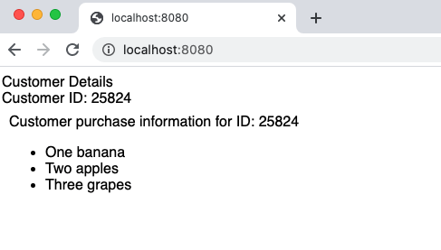

# Puzzle time
## The problem
I have a page that contains an Iframe, it looks like this:

But when I try and test this in Cypress, the Customer ID doesn't appear in the iFrame:

Why isn't this working?

You can view the code for the [page](./index.html), and the code for the [iFrame](./frame.html).

I'll freely admit this is a bit of a contrived example, but it was an interesting learning regardless.

## To run
If you want to see for your self, clone this repo and then
Install dependencies
> npm i

Start the server
> npx http-server

Start cypress
> npx cypress open

Click on `test.spec.js` and watch it fail!